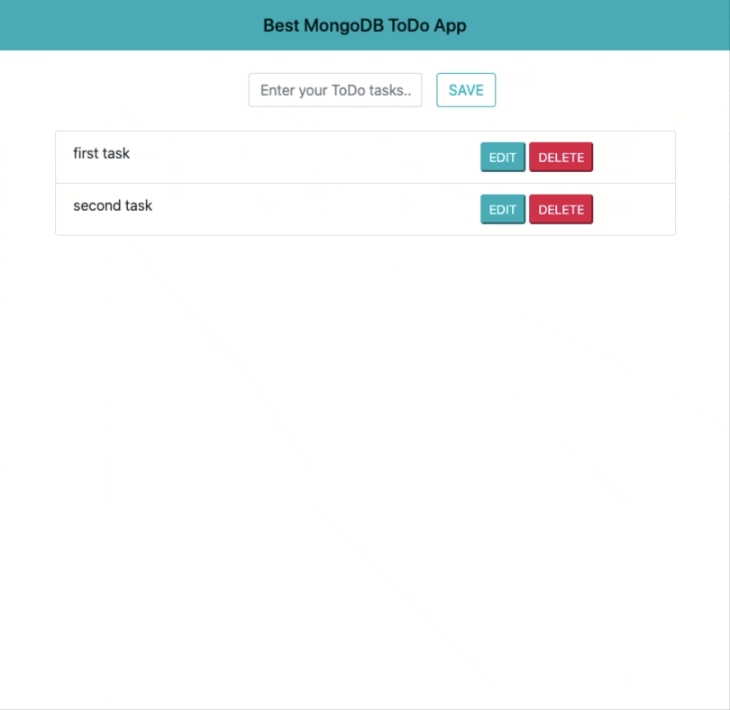

# TODO APP - Mongodb_CRUD

> A simple responsive ToDo App using Mongodb and Node.js



**Built With :**

- HTML
- BOOTSTRAP
- MONGODB
- JQUERY
- NODE.JS

## Inspiration

```sh
[FreeCodeCamp.org](https://www.youtube.com/watch?v=CyTWPr_WwdI)
```

## Usage

```sh
1- use ` npm install ` to install the packages
2- use ` npm run dev ` to connect to server as Dev or `npm run start` to normally connect to server
```

## 🤝 Contributing

Contributions, issues and feature requests are welcome!<br />Feel free to check [issues page](https://github.com/MoSaif00/TodoApp-MongoDB-CRUD/issues).
